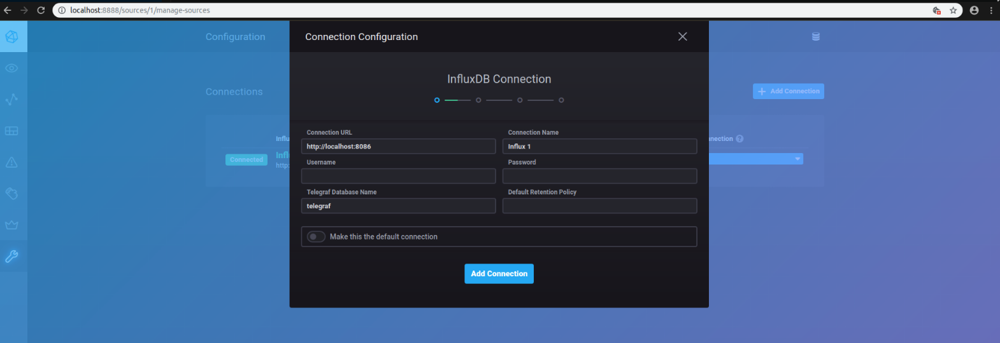
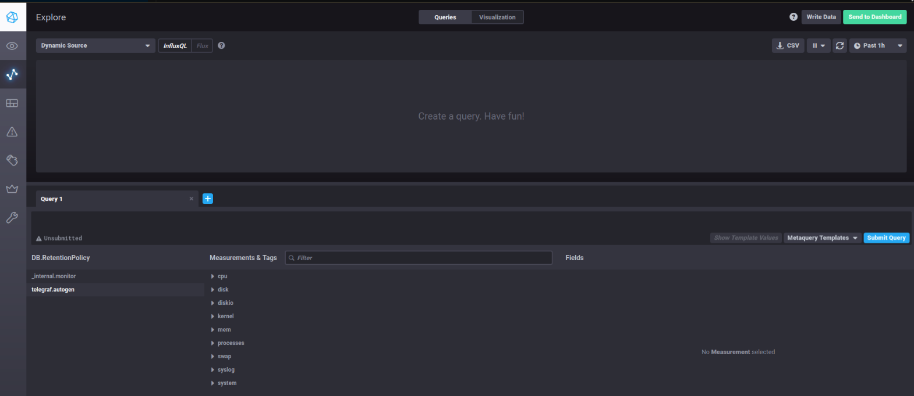
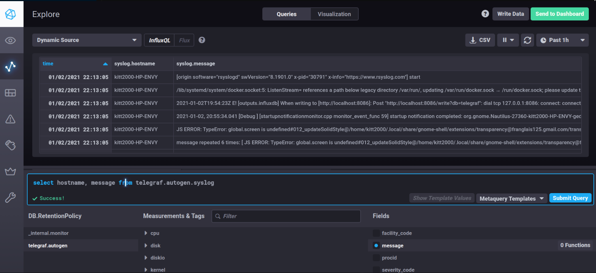
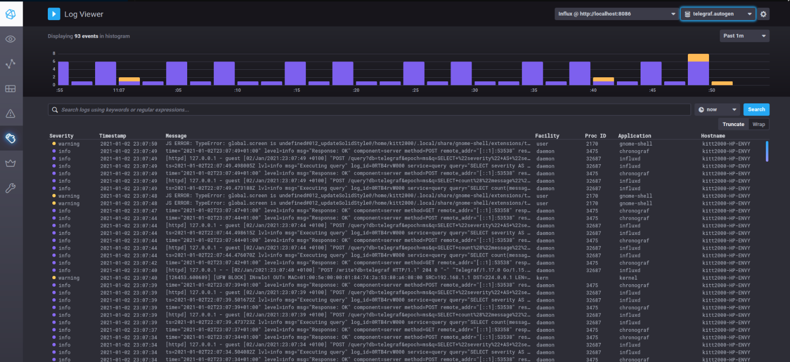
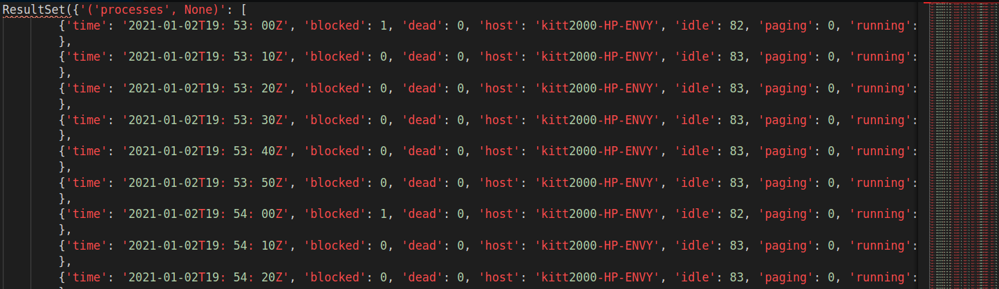

# InfluxDB-Linux-Logs-Monitor
 
InfluxDB is a common database being used for timeseries monitoring.

This tutorial show how to use InfluxDB, Telegraf and Chronograf to monitor Linux logs.

- InfluxDB to store logs
- Telegraf plugin to load logs
- Chronograf as UI to monitor logs

## 1. Rsyslog Config

If `rsyslog` is not installed:

```bash
sudo apt-get install rsyslog
```

Configuration

```bash
sudo su
cd /etc

gedit rsyslog.conf

exit
```

Add the following params and save file.

```
$WorkDirectory /tmp/rsyslog # temporary directory for storing data 
$ActionQueueType LinkedList # use asynchronous processing 
$ActionQueueFileName srvrfwd # set file name, also enables disk mode 
$ActionResumeRetryCount -1 # infinite retries on insert failure 
$ActionQueueSaveOnShutdown on # save in-memory data if rsyslog shuts down 
$ModLoad imudp #loads the udp module 
#listen for messages on udp localhost:514 $UDPServerAddress localhost $UDPServerRun 514 *.* 
@@(o)127.0.0.1:6514;RSYSLOG_SyslogProtocol23Format
```

Restart rsyslog service

```bash
sudo systemctl restart rsyslog
```

## 2. Telegraf Config

Install Telegraf

```bash
wget https://dl.influxdata.com/telegraf/releases/telegraf_1.17.0-1_amd64.deb
sudo dpkg -i telegraf_1.17.0-1_amd64.deb
```

Check if Telegraf has been installed correctly:

```bash
telegraf --version
```

Configure Telegraf

```bash
sudo su
cd /etc/telegraf

gedit telegraf.conf

exit
```

Uncommend the following lines and save the file:

```bash
# # Accepts syslog messages per RFC5425
 [[inputs.syslog]]
#   ## Specify an ip or hostname with port - eg., tcp://localhost:6514, tcp://10.0.0.1:6514
#   ## Protocol, address and port to host the syslog receiver.
#   ## If no host is specified, then localhost is used.
#   ## If no port is specified, 6514 is used (RFC5425#section-4.1).
 server = "tcp://localhost:6514"
```

Restart Telegraf service

```bash
systemctl restart telegraf
```

## 3. Install InfluxDB

```bash
sudo apt install influxdb
sudo apt install influxdb-client
```

Check if db has been installed correctly:

```bash
influx
```
```bash
>> Connected to http://localhost:8086 version 1.6.4
>> InfluxDB shell version: 1.6.4
```
```bash
use telegraf
```
```bash
>> Using database telegraf
```
```sql
SHOW MEASUREMENTS
```
```
name: measurements
name
----
cpu
disk
diskio
kernel
mem
processes
swap
syslog
system
```

Check existing databases:

```bash
name: databases
name
----
telegraf
_internal
```

Fetch logs from processes:

```sql
SELECT * FROM processes
```
```
time                blocked dead host             idle paging running sleeping stopped total total_threads unknown zombies
----                ------- ---- ----             ---- ------ ------- -------- ------- ----- ------------- ------- -------
1609617180000000000 1       0    kitt2000-HP-ENVY 82   0      0       391      0       474   2614          0       0
```

Data is correct!

## 4. Install Chronograf

```bash
wget https://dl.influxdata.com/chronograf/releases/chronograf_1.7.11_amd64.deb
```

```bash
sudo dpkg -i chronograf_1.7.11_amd64.deb
```

Run chronograf service

```bash
sudo systemctl enable chronograf.service
sudo systemctl --system daemon-reload
sudo systemctl start chronograf.service
```

Chronograf should be available under 8888 port (http://localhost:8888).



After establishing connection to InfluxDB you can check the content of Telefraf db. In order to do that you can go to Explore section, that is located on the left bar.



Here you can also exexute a simple SQL query:

```sql
select hostname, message from telegraf.autogen.syslog
```



Real-Time Logs monitoring from /etc/log/syslog is located in Log Viewer section, that is also located on the left bar.



## 5. (Optional) Use python to fetch logs

Install influxdb package

```bash
python3 -m pip install influxdb
```

```python
from influxdb import InfluxDBClient

client = InfluxDBClient(host='localhost', port=8086)

client.get_list_database()
```
```
>> [{'name': 'telegraf'}, {'name': '_internal'}]
```

```python
client.switch_database('telegraf')
client.query('SELECT * FROM "telegraf"."autogen"."processes"')
```

Results in terminal:

